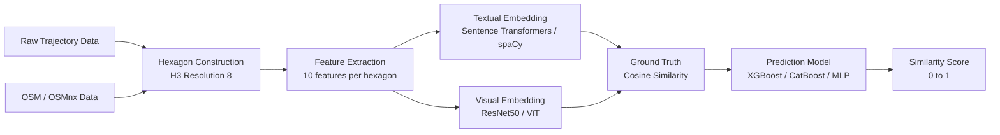

# Multi-modal Learning for Measuring Regional Similarity

> **Lab:** Spatio-Temporal Data Analytics — Rheinische Friedrich-Wilhelms-Universität Bonn


---

## Overview

This project develops a **multimodal framework for measuring geographic regional similarity**. Given two urban regions — represented as H3 hexagonal cells — the system computes a similarity score by fusing three data modalities:

- **Textual features** — OSM-derived amenity data, trajectory statistics, and environmental features encoded into sentence embeddings
- **Visual features** — Map images (via QGIS + OSM) and trajectory images (via OSMnx), embedded with ResNet50 and ViT
- **Geospatial features** — Sub-trajectory statistics, water/tree coverage, geohash encodings

The framework was applied to the **San Francisco (SF)** dataset from the *Patterns of Life* simulation, covering 149 hexagonal regions at H3 resolution 8.

---

## Pipeline



---

## Features Extracted per Hexagon

| ID | Feature | Type | Similarity Metric |
|----|---------|------|-------------------|
| s1 | Amenity types | Categorical | Jaccard |
| s2 | Amenity count | Numerical | Normalized distance |
| s3 | Sub-trajectory count | Numerical | Normalized distance |
| s4 | Total trajectory length | Numerical | Normalized distance |
| s5a | Mean sub-traj centroid distance | Numerical | Normalized distance |
| s5b | Mean point to centroid distance | Numerical | Normalized distance |
| s6a | Water area percentage | Numerical | Normalized distance |
| s6b | Tree area percentage | Numerical | Normalized distance |
| s7 | Amenities along trajectories | Numerical | Normalized distance |
| s8 | Geohash encoding | Categorical | — |

Similarity formulas used:

$$J(A,B) = \frac{|A \cap B|}{|A \cup B|} \qquad S_{num}(x_i, x_j) = 1 - \frac{|x_i - x_j|}{\max(x) - \min(x)}$$

---

## Results

### Ground Truth vs. Predicted Similarity (XGBoost)

| Ground Truth | Predicted |
|---|---|
|  |  |

### Per-Feature Pairwise Similarity Heatmaps

| Amenity Types (s1) | Amenity Count (s2) | Sub-traj Count (s3) |
|---|---|---|
|  |  |  |

| Water Area (s6a) | Tree Area (s6b) | Mean Similarity |
|---|---|---|
|  |  |  |

### Exploratory Data Analysis

| Trajectory Distribution | Amenity Wordcloud | Feature Correlation |
|---|---|---|
|  |  |  |

### Model Performance (MSE / Pearson Correlation)

| Embedding | Prediction Model | MSE | Pearson |
|---|---|---|---|
| RegionEncoder | XGBoost | 0.0001 | **0.9984** |
| Hex2Vec | XGBoost | 0.0005 | 0.9939 |
| Scalar + SpaCy | XGBoost | 0.0002 | 0.9968 |
| RegionEncoder | CatBoost | 0.0006 | 0.9920 |
| RegionEncoder | MLP | 0.0062 | 0.9164 |
| Scalar + SpaCy | MLP | 0.0860 | 0.047 |

> XGBoost significantly outperforms MLP due to the mixed numeric + categorical nature of the feature space.

---

## Repository Structure

```
.
├── code_files/
│   └── San francisco Dataset/
│       ├── multi_modal_regional_similarity.ipynb   # Main pipeline (125 cells)
│       ├── amen_extraction.ipynb                   # OSM amenity extraction
│       ├── geohash.ipynb                           # Geohash encoding
│       ├── image_generation.ipynb                  # Hexagon map image rendering
│       ├── requirements.txt                        # Python dependencies
│       ├── csv_files/                              # Processed feature CSVs (10 features)
│       ├── heatmaps/                               # Similarity heatmap visualizations
│       ├── EDA/                                    # Exploratory data analysis plots
│       ├── hexagon_images/                         # OSMnx trajectory images
│       ├── hexagon_images_gen/                     # QGIS-rendered map images
│       └── output/                                 # Model prediction visualizations
└── data_files/                                     # Place raw trajectory data here
```

---

## Installation

```bash
git clone https://github.com/Humeruzz/dslabregionalsmilarity.git
cd dslabregionalsmilarity
pip install -r "code_files/San francisco Dataset/requirements.txt"
```

**Key dependencies:** `geopandas`, `h3`, `osmnx`, `shapely`, `folium`, `tensorflow`, `torch`, `sentence-transformers`, `xgboost`, `scikit-learn`, `pandas`, `numpy`

---

## Usage

Run the notebooks in this order:

1. **`amen_extraction.ipynb`** — Extract OSM amenities per hexagon (features s1, s2, s7)
2. **`geohash.ipynb`** — Encode hexagon centroids to geohash (feature s8)
3. **`image_generation.ipynb`** — Render hexagon map images (requires QGIS)
4. **`multi_modal_regional_similarity.ipynb`** — Full pipeline: feature engineering → embeddings → training → evaluation

> Raw trajectory data (TSV format, *Patterns of Life* dataset) must be placed in `data_files/` before running.

---

## Tech Stack

| Category | Libraries |
|---|---|
| Geospatial | `h3`, `geopandas`, `osmnx`, `shapely`, `folium`, `pyproj` |
| Deep Learning | `tensorflow 2.18`, `pytorch 2.2`, `torchvision`, `keras` |
| NLP / Embeddings | `sentence-transformers`, `transformers`, `spaCy` |
| ML Models | `scikit-learn`, `xgboost`, `catboost` |
| Image Processing | `pillow`, `ResNet50`, `ViT` |
| Data | `pandas`, `numpy`, `dask`, `swifter` |
| Visualization | `matplotlib`, `seaborn`, `folium`, `wordcloud` |

---

## Team Contributions

| Member | Contributions |
|---|---|
| Junior Atemebang Ashu | SF data preprocessing, textual features, similarity computations, trajectory embeddings |
| Aleksandr Semenikhin | SF data preprocessing, map image extraction, textual features, prediction models |
| Cong Zhao | Atlanta visual feature extraction, visual embeddings, model implementation, ground truth |
| Chuong Dinh Le | Atlanta textual features, textual embeddings, model implementation, ground truth |
| Huy To Quang | Atlanta preprocessing, baseline models (RegionEncoder, Hex2Vec), ground truth |

---

## References

1. T. Chen & C. Guestrin. *XGBoost: A Scalable Tree Boosting System*. KDD 2016.
2. L. Prokhorenkova et al. *CatBoost: unbiased boosting with categorical features*. NeurIPS 2018.
3. P. Jenkins et al. *Unsupervised Representation Learning of Spatial Data via Multimodal Embedding (RegionEncoder)*. CIKM 2019.
4. P. Han et al. *A Graph-based Approach for Trajectory Similarity Computation in Spatial Networks*. KDD 2021.
5. S. Woźniak & P. Szymański. *Hex2Vec – Context-Aware Embedding H3 Hexagons with OpenStreetMap Tags*. ACM SIGSPATIAL 2021.
6. H. Amiri et al. *Massive Trajectory Data Based on Patterns of Life*. SIGSPATIAL 2023.
7. D. Guo et al. *SpatialScene2Vec: A self-supervised contrastive representation learning method for spatial scene similarity evaluation*. IJAEOG 2024.

---

## License

MIT License — see [LICENSE](LICENSE) for details.
